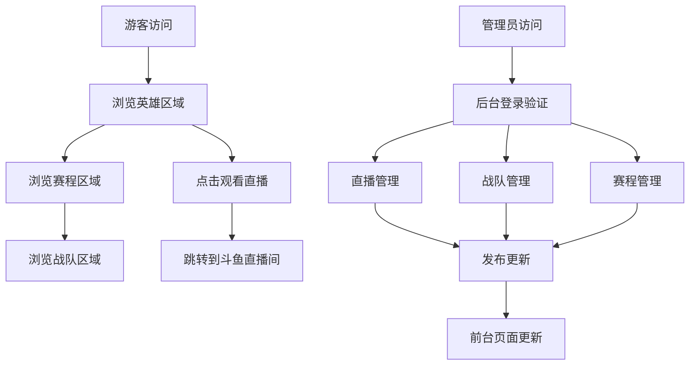

## 1. 产品概述
驴酱公会LOL娱乐赛事网站是一个仿照LPL官方赛事网站的单页面滚动式网站，为斗鱼驴酱公会的主播和水友提供赛事信息展示平台。网站采用竞技风格设计，同时融入娱乐元素，为观众提供直播跳转、战队信息和赛程查看功能。

## 2. 核心功能

### 2.1 用户角色
| 角色 | 访问方式 | 核心权限 |
|------|----------|----------|
| 游客 | 直接访问网站 | 查看赛事信息、战队信息、赛程信息，跳转到直播间 |
| 管理员 | 通过特定URL访问后台 | 配置直播链接、管理战队和队员信息、管理赛程信息 |

### 2.2 功能模块
网站包含以下主要页面：
1. **主页面**：单页面滚动设计，包含英雄区域、赛程区域、战队区域
2. **管理后台页面**：独立的配置管理界面，包含直播管理、战队管理、赛程管理

### 2.3 页面详情
| 页面名称 | 模块名称 | 功能描述 |
|-----------|-------------|-------------|
| 主页面 | 英雄区域 | 显示赛事横幅、标题、观看直播按钮，点击跳转到指定直播间 |
| 主页面 | 赛程区域 | 以树状图形式展示赛程信息，包含对战结果和比分 |
| 主页面 | 战队区域 | 展示参赛战队信息和队员信息卡片 |
| 管理后台 | 直播管理 | 配置和修改直播跳转链接地址 |
| 管理后台 | 战队管理 | 添加、编辑、删除战队信息和队员信息 |
| 管理后台 | 赛程管理 | 实时编辑赛程信息、对战结果和比分，修改后确认发布生效 |

## 3. 核心流程

### 游客访问流程
游客访问网站首页，可以通过滚动鼠标浏览不同的模块。在英雄区域点击"观看直播"按钮会跳转到指定的斗鱼直播间。在赛程区域可以查看所有比赛的对阵信息和结果，在战队区域可以查看各战队的详细信息。

### 管理员操作流程
管理员通过特定的后台URL访问管理界面，需要进行身份验证。登录后可以配置直播链接、管理战队和队员信息、编辑赛程和对战结果。所有修改需要确认发布后才能在前台生效。

## 4. 用户界面设计

### 4.1 设计风格
- **主色调**：深蓝色（#1E3A8A）搭配金色（#F59E0B），体现竞技感
- **辅助色**：深灰色（#374151）和白色（#FFFFFF）用于背景对比
- **按钮样式**：圆角矩形，悬停时有发光效果，CTA按钮使用金色渐变
- **字体**：标题使用阿里巴巴普惠体Bold，正文使用思源黑体
- **布局风格**：单页面滚动，每个区域占满视口高度，使用卡片式布局
- **图标风格**：使用游戏风格图标，可搭配emoji表情增加娱乐性

### 4.2 页面设计概述
| 页面名称 | 模块名称 | UI元素 |
|-----------|-------------|-------------|
| 主页面 | 英雄区域 | 全屏背景图使用LOL游戏截图，中央显示"驴酱杯"金色标题，下方金色渐变按钮"观看直播"，按钮悬停有发光动画效果 |
| 主页面 | 赛程区域 | 深色背景，使用树状图展示淘汰赛制，每个对战卡片显示战队logo、名称、比分，胜者有金色边框高亮 |
| 主页面 | 战队区域 | 网格布局展示战队卡片，每个卡片包含战队logo、名称、队员头像列表，鼠标悬停显示详细信息 |
| 管理后台 | 管理面板 | 简洁的表格界面，左侧导航栏，右侧内容区域，使用表单进行数据编辑，有保存和发布按钮 |

### 4.3 响应式设计
采用桌面端优先设计，适配1200px以上宽度。移动端通过媒体查询进行适配，主要调整：
- 英雄区域文字大小缩小
- 赛程树状图改为垂直排列
- 战队卡片从网格布局改为单列布局
- 管理后台采用堆叠式表单布局