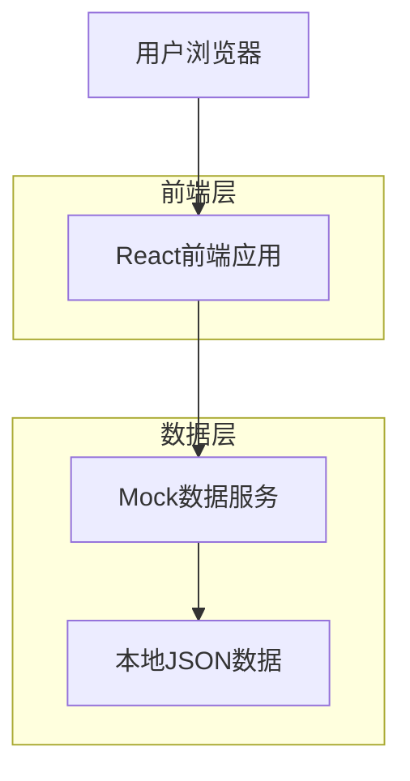
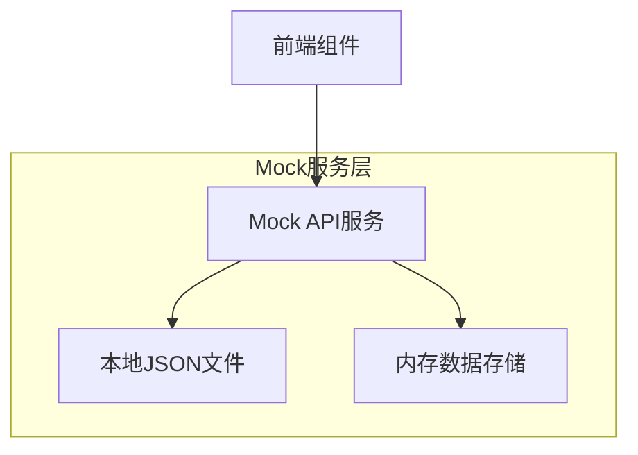
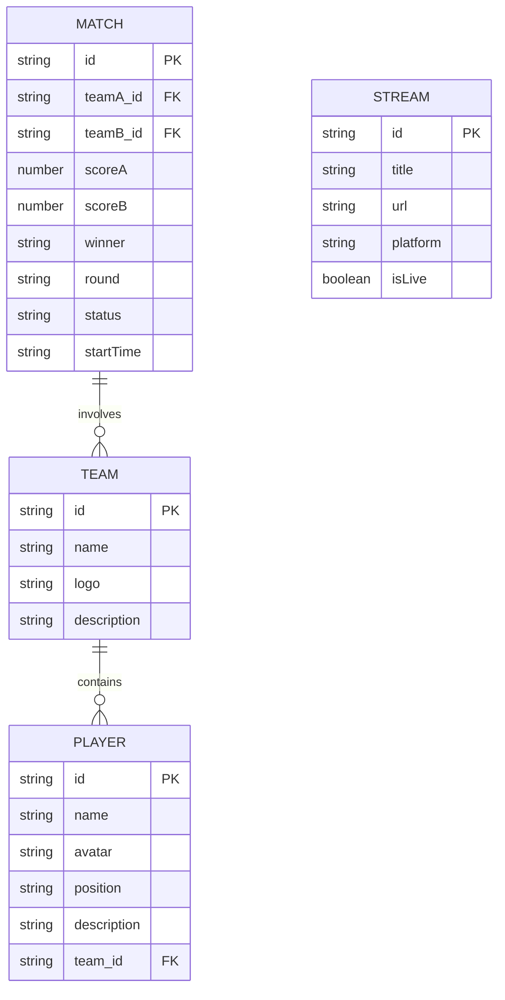

## 1. 架构设计



## 2. 技术描述

- **前端**: React@18 + tailwindcss@3 + vite
- **初始化工具**: vite-init
- **后端**: 无（使用Mock数据）
- **状态管理**: React Context + useState
- **路由**: React Router（用于后台管理页面）
- **UI组件**: 自定义组件 + Tailwind CSS

## 3. 路由定义

| 路由 | 用途 |
|-------|---------|
| / | 主页面，单页面滚动展示赛事信息 |
| /admin | 管理后台登录页面 |
| /admin/dashboard | 管理后台主面板 |
| /admin/stream | 直播链接管理 |
| /admin/teams | 战队信息管理 |
| /admin/schedule | 赛程信息管理 |

## 4. 数据结构定义

### 4.1 核心数据类型

```typescript
// 战队类型
type Team = {
  id: string;
  name: string;
  logo: string;
  players: Player[];
  description: string;
}

// 队员类型
type Player = {
  id: string;
  name: string;
  avatar: string;
  position: string;
  description: string;
}

// 赛程类型
type Match = {
  id: string;
  teamA: Team;
  teamB: Team;
  scoreA: number;
  scoreB: number;
  winner: string | null;
  round: string;
  status: 'upcoming' | 'ongoing' | 'finished';
  startTime: string;
}

// 直播信息类型
type StreamInfo = {
  title: string;
  url: string;
  platform: string;
  isLive: boolean;
}
```

## 5. Mock数据架构



## 6. 数据模型

### 6.1 数据模型定义



### 6.2 Mock数据示例

```javascript
// teams.json
[
  {
    "id": "team1",
    "name": "驴酱一队",
    "logo": "/assets/team1-logo.png",
    "description": "驴酱公会精英战队",
    "players": [
      {
        "id": "player1",
        "name": "驴酱主播A",
        "avatar": "/assets/player1.png",
        "position": "上单",
        "description": "技术型主播"
      }
    ]
  }
]

// matches.json
[
  {
    "id": "match1",
    "teamA_id": "team1",
    "teamB_id": "team2",
    "scoreA": 2,
    "scoreB": 1,
    "winner": "team1",
    "round": "半决赛",
    "status": "finished",
    "startTime": "2025-03-01T20:00:00"
  }
]

// stream.json
{
  "title": "驴酱杯总决赛直播",
  "url": "https://www.douyu.com/12345",
  "platform": "斗鱼直播",
  "isLive": true
}
```