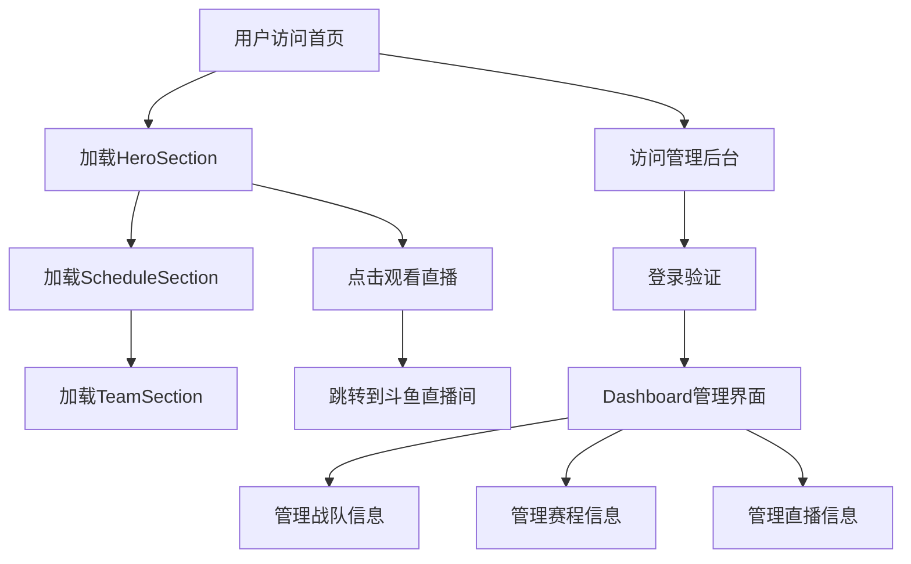
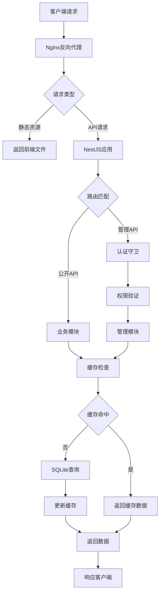

# 驴酱杯赛事网站 - 项目整体架构文档

## 1. 架构概述

驴酱杯赛事网站采用**前后端分离**的现代Web架构，基于React + TypeScript前端和Node.js + NestJS后端，使用SQLite作为数据库，部署在2C2G服务器上。

### 1.1 架构设计原则

| 原则 | 说明 |
|------|------|
| **前后端分离** | 前端负责UI渲染，后端负责数据处理，职责清晰 |
| **模块化设计** | 按功能划分模块，提高代码可维护性 |
| **资源高效** | 充分利用2C2G服务器资源，避免过度消耗 |
| **AI友好** | 选择AI代码生成质量高的技术栈 |
| **可扩展性** | 预留扩展接口，支持未来功能升级 |

## 2. 整体架构图

```
┌────────────────────────────────────────────────────────────────┐
│                      2C2G 云服务器                           │
│                                                               │
│  ┌──────────────────────────────────────────────────────┐      │
│  │                    Nginx (80/443)                   │      │
│  │  - 反向代理                                         │      │
│  │  - 静态文件服务 (前端构建产物)                       │      │
│  │  - API路由转发 (/api → 后端服务)                   │      │
│  └──────────────┬──────────────────────────────┬───────┘      │
│                 │                              │              │
│  ┌──────────────▼────────────────┐   ┌─────────▼────────────┐ │
│  │     前端应用 (React + TS)      │   │    后端服务          │ │
│  │  - 单页面应用                  │   │  - NestJS + SQLite   │ │
│  │  - 组件化设计                  │   │  - 模块化架构        │ │
│  │  - 状态管理 (Zustand)          │   │  - 内存缓存          │ │
│  │  - 轮询更新机制                │   │  - RESTful API       │ │
│  └───────────────────────────────┘   └─────────────────────┘ │
│                                                               │
│  ┌──────────────────────────────────────────────────────┐      │
│  │                   数据存储                           │      │
│  │  ┌──────────────────┐  ┌───────────────────────┐    │      │
│  │  │  SQLite 数据库   │  │  备份存储 (daily)     │    │      │
│  │  │  - lvjiang.db    │  │  - 每日自动备份       │    │      │
│  │  └──────────────────┘  └───────────────────────┘    │      │
│  └──────────────────────────────────────────────────────┘      │
│                                                               │
└────────────────────────────────────────────────────────────────┘
```

## 3. 前端架构

### 3.1 技术栈

| 技术 | 版本 | 用途 |
|------|------|------|
| React | 18.3.1 | UI框架 |
| TypeScript | 5.8.3 | 类型安全 |
| React Router | 7.13.1 | 路由管理 |
| Zustand | 5.0.3 | 状态管理 |
| Tailwind CSS | 3.4.17 | 样式框架 |
| Framer Motion | 12.34.5 | 动画效果 |

### 3.2 模块划分

```
frontend/
├── src/
│   ├── components/           # 可复用组件
│   │   ├── features/         # 业务组件
│   │   │   ├── HeroSection.tsx        # 英雄区域
│   │   │   ├── ScheduleSection.tsx    # 赛程区域
│   │   │   ├── TeamSection.tsx        # 战队区域
│   │   │   ├── SwissStage.tsx         # 瑞士轮展示
│   │   │   └── EliminationStage.tsx   # 淘汰赛展示
│   │   ├── layout/           # 布局组件
│   │   │   ├── Layout.tsx             # 主布局
│   │   │   ├── AdminLayout.tsx        # 后台布局
│   │   │   └── ProtectedRoute.tsx     # 权限路由
│   │   └── ui/               # UI组件
│   │       ├── button.tsx
│   │       ├── card.tsx
│   │       └── tabs.tsx
│   ├── pages/                # 页面
│   │   ├── Home.tsx                    # 首页
│   │   └── admin/                      # 后台页面
│   │       ├── Dashboard.tsx
│   │       ├── Teams.tsx
│   │       ├── Schedule.tsx
│   │       ├── Stream.tsx
│   │       └── Login.tsx
│   ├── hooks/                # 自定义Hooks
│   │   └── useTheme.ts
│   ├── store/                # 状态管理
│   │   └── advancementStore.ts
│   ├── types/                # 类型定义
│   │   └── index.ts
│   ├── utils/                # 工具函数
│   │   └── datetime.ts
│   ├── App.tsx               # 应用入口
│   └── main.tsx              # 渲染入口
├── public/                   # 静态资源
├── package.json              # 依赖管理
├── vite.config.ts            # 构建配置
└── tailwind.config.js        # Tailwind配置
```

### 3.3 核心流程



### 3.4 状态管理

| 状态 | 管理方式 | 用途 |
|------|----------|------|
| 赛事数据 | Zustand | 全局状态管理 |
| 组件状态 | React useState | 局部状态 |
| 表单状态 | React useForm | 表单管理 |
| 路由状态 | React Router | 页面导航 |

### 3.5 数据更新机制

```typescript
// 前端轮询方案
import { useQuery } from '@tanstack/react-query';

export function useMatches() {
  return useQuery({
    queryKey: ['matches'],
    queryFn: fetchMatches,
    refetchInterval: 30000, // 30秒轮询一次
    staleTime: 15000,       // 15秒内视为新鲜数据
  });
}
```

## 4. 后端架构

### 4.1 技术栈

| 技术 | 版本 | 用途 |
|------|------|------|
| Node.js | 20 LTS | 运行时 |
| NestJS | 10.x | 后端框架 |
| SQLite | 3.x | 数据库 |
| better-sqlite3 | 9.x | SQLite驱动 |
| node-cache | 5.x | 内存缓存 |
| JWT | - | 认证 |
| PM2 | 5.x | 进程管理 |

### 4.2 模块划分

```
backend/
├── src/
│   ├── modules/             # 业务模块
│   │   ├── teams/           # 战队管理
│   │   │   ├── teams.controller.ts
│   │   │   ├── teams.service.ts
│   │   │   └── teams.module.ts
│   │   ├── matches/         # 赛程管理
│   │   │   ├── matches.controller.ts
│   │   │   ├── matches.service.ts
│   │   │   └── matches.module.ts
│   │   ├── streams/         # 直播管理
│   │   │   ├── streams.controller.ts
│   │   │   ├── streams.service.ts
│   │   │   └── streams.module.ts
│   │   └── auth/            # 认证管理
│   │       ├── auth.controller.ts
│   │       ├── auth.service.ts
│   │       └── auth.module.ts
│   ├── database/            # 数据库
│   │   ├── database.module.ts
│   │   ├── database.service.ts
│   │   └── migrations/      # 数据库迁移
│   ├── cache/               # 缓存
│   │   └── cache.service.ts
│   ├── common/              # 公共
│   │   ├── dto/             # 数据传输对象
│   │   ├── guards/          # 守卫
│   │   └── interceptors/    # 拦截器
│   ├── config/              # 配置
│   │   └── app.config.ts
│   └── main.ts              # 应用入口
├── data/                    # 数据存储
│   └── lvjiang.db           # SQLite数据库文件
├── backup/                  # 备份
│   └── daily/               # 每日备份
├── package.json             # 依赖管理
├── tsconfig.json            # TypeScript配置
├── nest-cli.json            # NestJS配置
└── ecosystem.config.js      # PM2配置
```

### 4.3 核心流程



### 4.4 缓存策略

| 缓存键 | TTL | 说明 |
|--------|------|------|
| `teams:all` | 60秒 | 所有战队信息 |
| `teams:{id}` | 60秒 | 单个战队详情 |
| `matches:all` | 60秒 | 所有比赛信息 |
| `matches:{id}` | 60秒 | 单个比赛详情 |
| `stream:info` | 60秒 | 直播信息 |

### 4.5 数据模型

| 实体 | 关系 | 说明 |
|------|------|------|
| **Team** | 1:N Player | 战队包含多个队员 |
| **Player** | N:1 Team | 队员属于一个战队 |
| **Match** | N:1 Team (team_a) | 比赛包含两个战队 |
| **Match** | N:1 Team (team_b) | 同上 |
| **StreamInfo** | 1:1 | 全局直播配置 |

## 5. 数据库设计

### 5.1 表结构

#### 5.1.1 teams表
| 字段名 | 数据类型 | 约束 | 描述 |
|--------|----------|------|------|
| id | TEXT | PRIMARY KEY | 战队ID |
| name | TEXT | NOT NULL | 战队名称 |
| logo | TEXT | | 战队Logo URL |
| description | TEXT | | 战队描述 |

#### 5.1.2 players表
| 字段名 | 数据类型 | 约束 | 描述 |
|--------|----------|------|------|
| id | TEXT | PRIMARY KEY | 队员ID |
| name | TEXT | NOT NULL | 队员名称 |
| avatar | TEXT | | 队员头像URL |
| position | TEXT | | 位置 |
| team_id | TEXT | FOREIGN KEY | 所属战队ID |

#### 5.1.3 matches表
| 字段名 | 数据类型 | 约束 | 描述 |
|--------|----------|------|------|
| id | TEXT | PRIMARY KEY | 比赛ID |
| team_a_id | TEXT | | 战队A ID |
| team_b_id | TEXT | | 战队B ID |
| score_a | INTEGER | DEFAULT 0 | 战队A得分 |
| score_b | INTEGER | DEFAULT 0 | 战队B得分 |
| winner_id | TEXT | | 获胜战队ID |
| round | TEXT | | 轮次 |
| status | TEXT | | 状态(upcoming/ongoing/finished) |
| start_time | TEXT | | 开始时间 |
| stage | TEXT | | 阶段(swiss/elimination) |
| swiss_record | TEXT | | 瑞士轮战绩 |
| swiss_day | INTEGER | | 瑞士轮天数 |

#### 5.1.4 stream_info表
| 字段名 | 数据类型 | 约束 | 描述 |
|--------|----------|------|------|
| id | INTEGER | PRIMARY KEY AUTOINCREMENT | ID |
| title | TEXT | | 直播标题 |
| url | TEXT | | 直播链接 |
| is_live | INTEGER | DEFAULT 0 | 是否直播中 |

### 5.2 索引设计

| 表 | 索引 | 类型 | 用途 |
|------|------|------|------|
| teams | id | PRIMARY | 主键索引 |
| players | id | PRIMARY | 主键索引 |
| players | team_id | INDEX | 加速按战队查询队员 |
| matches | id | PRIMARY | 主键索引 |
| matches | stage | INDEX | 按阶段查询比赛 |
| matches | status | INDEX | 按状态查询比赛 |
| matches | start_time | INDEX | 按时间排序 |

## 6. API设计

### 6.1 公开API

| 路径 | 方法 | 模块 | 功能 | 响应 |
|------|------|------|------|------|
| `/api/teams` | GET | teams | 获取所有战队 | `[{id, name, logo, description, players}]` |
| `/api/teams/:id` | GET | teams | 获取单个战队 | `{id, name, logo, description, players}` |
| `/api/matches` | GET | matches | 获取所有比赛 | `[{id, teamA, teamB, scoreA, scoreB, winnerId, round, status, startTime, stage}]` |
| `/api/matches/:id` | GET | matches | 获取单个比赛 | `{id, teamA, teamB, scoreA, scoreB, winnerId, round, status, startTime, stage}` |
| `/api/stream` | GET | streams | 获取直播信息 | `{title, url, isLive}` |

### 6.2 管理API

| 路径 | 方法 | 模块 | 功能 | 请求体 |
|------|------|------|------|--------|
| `/api/admin/auth/login` | POST | auth | 登录 | `{username, password}` |
| `/api/admin/teams` | POST | teams | 创建战队 | `{name, logo, description}` |
| `/api/admin/teams/:id` | PUT | teams | 更新战队 | `{name, logo, description}` |
| `/api/admin/teams/:id` | DELETE | teams | 删除战队 | N/A |
| `/api/admin/players` | POST | teams | 创建队员 | `{name, avatar, position, teamId}` |
| `/api/admin/players/:id` | PUT | teams | 更新队员 | `{name, avatar, position, teamId}` |
| `/api/admin/players/:id` | DELETE | teams | 删除队员 | N/A |
| `/api/admin/matches` | POST | matches | 创建比赛 | `{teamAId, teamBId, round, status, startTime, stage}` |
| `/api/admin/matches/:id` | PUT | matches | 更新比赛 | `{scoreA, scoreB, winnerId, status}` |
| `/api/admin/matches/:id` | DELETE | matches | 删除比赛 | N/A |
| `/api/admin/stream` | PUT | streams | 更新直播信息 | `{title, url, isLive}` |

## 7. 部署架构

### 7.1 Docker Compose配置

```yaml
version: '3.8'
services:
  frontend:
    build: ./frontend
    ports:
      - "80:80"
    depends_on:
      - backend
    restart: always

  backend:
    build: ./backend
    ports:
      - "3000:3000"
    volumes:
      - ./backend/data:/app/data
      - ./backend/backup:/app/backup
    environment:
      - NODE_ENV=production
      - DATABASE_URL=file:/app/data/lvjiang.db
    restart: always
```

### 7.2 资源分配

| 服务 | CPU | 内存 | 存储 |
|------|------|------|------|
| 前端 | 0.5核 | 100MB | 200MB |
| 后端 | 1.5核 | 320MB | 100MB |
| Nginx | 0.2核 | 20MB | 50MB |
| **总计** | **2核** | **440MB** | **350MB** |

### 7.3 网络架构

| 网络 | 类型 | 用途 |
|------|------|------|
| 外部网络 | 公网 | 用户访问 |
| 内部网络 | 私有 | 服务间通信 |

## 8. 监控与运维

### 8.1 监控指标

| 指标 | 监控工具 | 告警阈值 |
|------|----------|----------|
| CPU使用率 | PM2 + 云监控 | >80% |
| 内存使用率 | PM2 + 云监控 | >80% |
| 响应时间 | Nginx日志 | >100ms |
| 错误率 | Nginx日志 | >1% |
| 数据库大小 | 脚本监控 | >50MB |

### 8.2 备份策略

| 类型 | 频率 | 保留 | 存储 |
|------|------|------|------|
| 数据库备份 | 每日 | 7天 | 本地 + OSS |
| 代码备份 | 每次部署 | 30天 | Git |
| 配置备份 | 每次修改 | 30天 | Git |

### 8.3 故障处理

| 故障 | 检测方式 | 处理方式 |
|------|----------|----------|
| 应用崩溃 | PM2监控 | 自动重启 |
| 内存溢出 | PM2监控 | 自动重启 |
| 数据库损坏 | 健康检查 | 恢复备份 |
| 服务器宕机 | 云监控 | 自动重启实例 |

## 9. 扩展性设计

### 9.1 水平扩展

| 组件 | 扩展方式 | 说明 |
|------|----------|------|
| 前端 | CDN + 多节点 | 静态资源分发 |
| 后端 | 多实例 + 负载均衡 | 增加处理能力 |
| 数据库 | SQLite → PostgreSQL | 支持分布式 |
| 缓存 | node-cache → Redis | 支持分布式缓存 |

### 9.2 功能扩展

| 功能 | 实现方式 | 所需资源 |
|------|----------|----------|
| 实时数据 | WebSocket | +100MB内存 |
| 用户系统 | JWT + 数据库 | +50MB内存 |
| 评论系统 | 数据库 + 缓存 | +100MB内存 |
| 统计分析 | 定时任务 | +50MB内存 |

### 9.3 技术演进路径

| 阶段 | 架构 | 适用场景 |
|------|------|----------|
| 阶段1 | 单服务器 + SQLite | 初始部署 |
| 阶段2 | 多服务器 + PostgreSQL | 中等规模 |
| 阶段3 | 微服务 + 容器编排 | 大规模 |

## 10. 安全设计

### 10.1 前端安全

| 安全项 | 措施 |
|--------|------|
| XSS防护 | React内置防护 + 输入验证 |
| CSRF防护 | 无状态JWT + SameSite cookie |
| 敏感数据 | 不在前端存储敏感信息 |
| 资源安全 | HTTPS + CSP |

### 10.2 后端安全

| 安全项 | 措施 |
|--------|------|
| 认证授权 | JWT + 角色权限 |
| 数据验证 | DTO验证 + 输入检查 |
| SQL注入 | 参数化查询 + ORM |
| 跨域请求 | CORS配置 |
| 密码存储 | bcrypt哈希 |

### 10.3 部署安全

| 安全项 | 措施 |
|--------|------|
| 容器安全 | 最小权限镜像 |
| 网络安全 | 防火墙 + 网络隔离 |
| 环境变量 | 加密存储 |
| 日志安全 | 敏感信息脱敏 |

## 11. 性能优化

### 11.1 前端优化

| 优化项 | 措施 | 效果 |
|--------|------|------|
| 代码分割 | Vite动态导入 | 首屏加载速度提升50% |
| 静态资源 | 压缩 + CDN | 加载速度提升60% |
| 缓存策略 | HTTP缓存 | 重复访问速度提升80% |
| 渲染优化 | React.memo + useMemo | 交互响应速度提升40% |

### 11.2 后端优化

| 优化项 | 措施 | 效果 |
|--------|------|------|
| 数据库 | WAL模式 + 索引 | 查询速度提升70% |
| 缓存 | 内存缓存 + TTL | 响应速度提升80% |
| 并发 | PM2集群模式 | 并发处理能力提升100% |
| 代码 | NestJS优化 | 启动速度提升30% |

### 11.3 服务器优化

| 优化项 | 措施 | 效果 |
|--------|------|------|
| Nginx | 静态缓存 + gzip | 静态资源速度提升60% |
| 系统 | 内存管理优化 | 内存使用效率提升20% |
| 网络 | TCP优化 | 网络延迟降低30% |

## 12. 结论

### 12.1 架构优势

1. **技术栈现代化**：React + TypeScript + NestJS，代码质量高
2. **资源高效**：2C2G服务器完全满足需求，成本极低
3. **部署简单**：Docker一键部署，环境一致性好
4. **可扩展性**：预留扩展接口，支持未来功能升级
5. **AI友好**：选择AI代码生成质量高的技术栈
6. **安全性**：多层安全措施，保障系统安全

### 12.2 适用场景

- **中小型赛事网站**：数据量小，访问量适中
- **预算有限项目**：月成本约100元，经济实惠
- **快速迭代项目**：开发效率高，部署简单
- **读多写少场景**：SQLite + 缓存策略效果显著

### 12.3 核心价值

- **技术领先**：采用现代Web技术栈
- **成本优势**：极低的部署和运维成本
- **开发效率**：AI辅助开发，快速上线
- **用户体验**：响应速度快，界面美观
- **可维护性**：模块化设计，易于维护

---

**文档版本**：v1.0  
**编写日期**：2026-03-10  
**作者**：AI架构师
