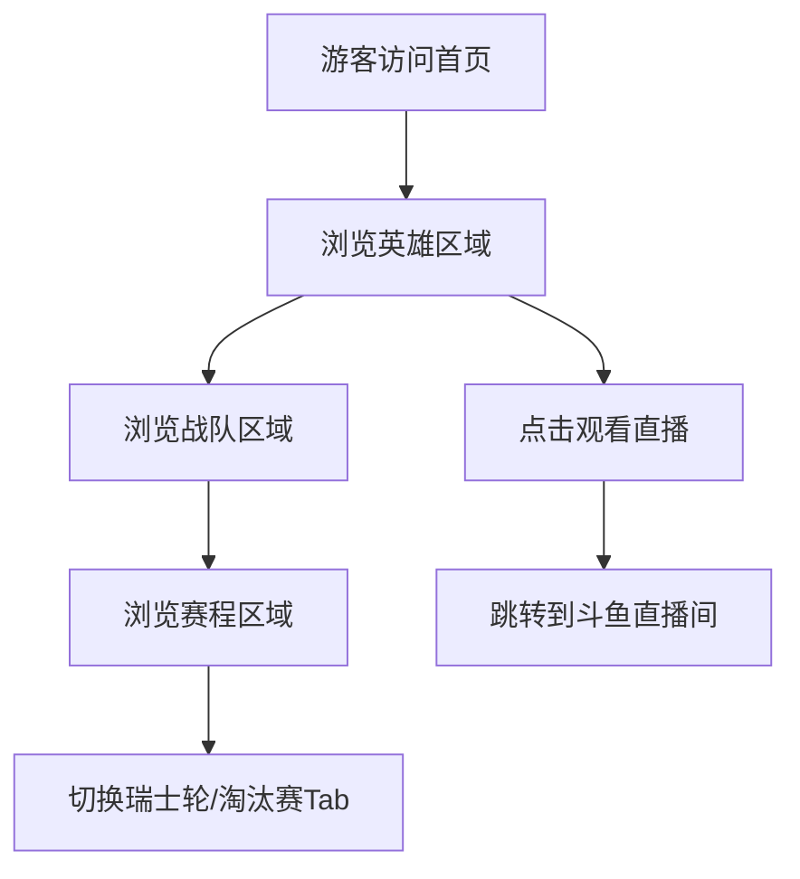
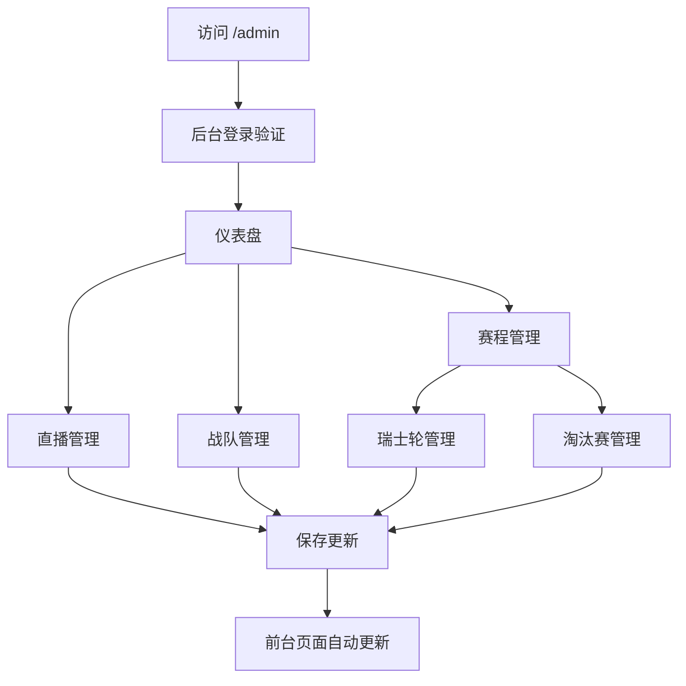

# 参照LOL S赛修改赛程 - 产品需求文档 (PRD)

&gt; 版本: v1.1  
&gt; 更新日期: 2026-04-07  
&gt; 状态: 待审核

---

## 1. 产品概述

驴酱杯LOL娱乐赛事网站将参照英雄联盟全球总决赛（S赛）的赛制进行赛程调整，以提升赛事的专业性和观赏性。
- **主要目的**：将参赛队伍固定为16支，采用LOL S赛的瑞士轮+淘汰赛赛制，为观众提供更专业的赛事体验
- **目标用户**：赛事观众、参赛战队、赛事管理员

---

## 2. 核心功能

### 2.1 用户角色

| 角色 | 访问方式 | 核心权限 |
|------|----------|----------|
| 游客 | 直接访问网站 | 查看赛事信息、战队信息、赛程信息，跳转到直播间 |
| 管理员 | 通过 `/admin` 路径访问后台 | 配置直播链接、管理战队和队员信息、管理赛程信息、管理瑞士轮晋级名单 |

### 2.2 功能模块

网站包含以下主要页面：
1. **主页面** (`/`): 单页面滚动设计，包含英雄区域、战队区域、赛程区域
2. **管理后台页面** (`/admin/*`): 独立的配置管理界面，包含仪表盘、直播管理、战队管理、赛程管理

### 2.3 页面详情

| 页面名称 | 模块名称 | 功能描述 |
|-----------|-------------|-------------|
| 主页面 | 英雄区域 | 显示赛事横幅、标题、观看直播按钮，点击跳转到指定直播间，显示直播状态 |
| 主页面 | 战队区域 | 展示16支参赛战队信息和队员信息卡片，显示队员位置图标 |
| 主页面 | 赛程区域 | 以Tab切换展示瑞士轮和淘汰赛赛程，瑞士轮按战绩分组展示，淘汰赛使用单败赛制树状图 |
| 管理后台 | 仪表盘 | 概览各管理模块状态，提供数据管理功能（加载Mock数据/清空数据） |
| 管理后台 | 直播管理 | 表单配置直播标题、链接、状态，保存后实时生效 |
| 管理后台 | 战队管理 | 卡片式展示，支持添加/编辑/删除战队，限制为最多16支战队，编辑时固定5个位置输入框 |
| 管理后台 | 赛程管理 | Tab切换瑞士轮/淘汰赛，瑞士轮可视化编辑器支持晋级名单管理，淘汰赛支持比分编辑 |

---

## 3. 核心流程

### 3.1 游客访问流程



### 3.2 管理员操作流程



---

## 4. 赛事赛制

### 4.1 参赛队伍
- **固定数量**：16支战队
- **管理限制**：管理后台限制最多添加16支战队

### 4.2 瑞士轮赛制 (Swiss Stage)

参照LOL S赛瑞士轮赛制：

#### 赛制规则
- **参赛队伍**：16支队伍
- **赛制结构**：
  - **第一轮** (0-0)：16支队伍随机配对，BO1，8场比赛
  - **第二轮**：
    - 高组 (1-0)：8支队伍，BO3，4场比赛
    - 低组 (0-1)：8支队伍，BO3，4场比赛
  - **第三轮**：
    - 高组 (2-0)：4支队伍，BO3，2场比赛
    - 中组 (1-1)：8支队伍，BO3，4场比赛
    - 低组 (0-2)：4支队伍，BO3，2场比赛
  - **第四轮**：
    - 高组 (3-0)：2支队伍，BO3，1场比赛
    - 中高组 (2-1)：6支队伍，BO3，3场比赛
    - 中低组 (1-2)：6支队伍，BO3，3场比赛
    - 低组 (0-3)：2支队伍，BO3，1场比赛

#### 晋级规则
- **前8名晋级淘汰赛**：
  - 3-0战绩：直接晋级
  - 3-1战绩：直接晋级
  - 3-2战绩：直接晋级
  - 2-3战绩：淘汰
  - 1-3战绩：淘汰
  - 0-3战绩：淘汰

#### BO1/BO3安排
- 第一轮：BO1
- 第二轮及以后：BO3

### 4.3 淘汰赛赛制 (Elimination Stage)

参照LOL S赛淘汰赛赛制：

#### 赛制结构
- **参赛队伍**：8支队伍（从瑞士轮晋级）
- **赛制类型**：单败淘汰赛
- **比赛格式**：所有比赛均为BO5（五局三胜）

#### 对阵安排
- **四分之一决赛**（4场）：通过抽签决定对阵，无固定对战规则，由管理员在后台编辑配置
- **半决赛**（2场）：四分之一决赛胜者对阵
- **决赛**（1场）：半决赛胜者对阵，决出冠军

---

## 5. 用户界面设计

### 5.1 设计风格

- **主色调**: 
  - 深蓝色 `#1E3A8A` (primary)
  - 金色 `#F59E0B` (secondary) - 用于高亮和CTA
- **辅助色**: 
  - 深灰色 `#374151`
  - 白色 `#FFFFFF`
  - 背景渐变: 从 primary 到 gray-900
- **按钮样式**: 圆角矩形，悬停时有发光效果，CTA按钮使用金色渐变
- **字体**: 系统默认字体栈
- **布局风格**: 单页面滚动，每个区域占满视口高度，使用卡片式布局
- **图标风格**: Lucide React 图标 + 自定义位置图标

### 5.2 页面设计概述

| 页面名称 | 模块名称 | UI元素 |
|-----------|-------------|-------------|
| 主页面 | 英雄区域 | 全屏背景图(LOL主题)，中央显示"驴酱杯"金色渐变标题，下方金色渐变按钮"观看直播"，显示直播状态 |
| 主页面 | 战队区域 | 网格布局展示16支战队卡片(1列/2列/4列响应式)，卡片包含战队logo、名称、队员头像列表和位置图标 |
| 主页面 | 赛程区域 | Tab切换瑞士轮/淘汰赛，瑞士轮按战绩分组展示（16队版本），淘汰赛使用可视化单败赛制图（8队BO5） |
| 管理后台 | 仪表盘 | 概览卡片 + 数据管理区域(加载Mock/清空数据) |
| 管理后台 | 战队管理 | 卡片式展示16支战队，显示"16/16"战队数量提示，超出时禁止添加 |
| 管理后台 | 赛程管理 | Tab切换瑞士轮/淘汰赛，瑞士轮可视化编辑器支持16队赛制和晋级名单管理，淘汰赛支持8队单败赛制和比分编辑 |

### 5.3 响应式设计

采用桌面端优先设计，适配1200px以上宽度。移动端通过媒体查询进行适配：

| 断点 | 布局调整 |
|------|----------|
| &lt; 640px (sm) | 战队卡片单列，赛程区域横向滚动 |
| 640px - 1024px (md) | 战队卡片2列，导航栏适配 |
| &gt; 1024px (lg) | 战队卡片4列，完整展示所有内容 |

---

## 6. 数据模型

### 6.1 核心实体

```typescript
// 队员
interface Player {
  id: string;
  name: string;
  avatar: string;
  position: string; // top/jungle/mid/bot/support
  description: string;
  teamId?: string;
}

// 战队
interface Team {
  id: string;
  name: string;
  logo: string;
  players: Player[];
  description: string;
}

// 比赛
interface Match {
  id: string;
  teamAId: string;
  teamBId: string;
  teamA?: Team;
  teamB?: Team;
  scoreA: number;
  scoreB: number;
  winnerId: string | null;
  round: string;
  status: 'upcoming' | 'ongoing' | 'finished';
  startTime: string;
  stage: 'swiss' | 'elimination';
  swissRecord?: string; // 瑞士轮战绩: "0-0", "1-0", "0-1", "1-1", "0-2", "2-0", "2-1", "1-2", "3-0", "3-1", "2-2", "3-2", "2-3", "1-3", "0-3"
  swissDay?: number; // 瑞士轮第几天
  swissRound?: number; // 瑞士轮第几轮 (1-4)
  eliminationBracket?: 'quarterfinals' | 'semifinals' | 'finals'; // 淘汰赛阶段
  eliminationGameNumber?: number; // 淘汰赛比赛编号
  boFormat?: 'BO1' | 'BO3' | 'BO5'; // 赛制格式
}

// 直播信息
interface StreamInfo {
  title: string;
  url: string;
  isLive: boolean;
}

// 瑞士轮晋级结果
interface SwissAdvancementResult {
  top8: string[]; // 前8名晋级淘汰赛
  eliminated: string[]; // 被淘汰队伍
  rankings: {
    teamId: string;
    record: string; // 如 "3-0", "3-1" 等
    rank: number; // 1-16
  }[];
}
```

---

## 7. API接口

### 7.1 Mock服务接口

| 接口 | 方法 | 描述 |
|------|------|------|
| `getTeams()` | GET | 获取所有战队（最多16支） |
| `updateTeam(team)` | PUT | 更新战队信息 |
| `addTeam(team)` | POST | 添加新战队（验证不超过16支） |
| `deleteTeam(id)` | DELETE | 删除战队 |
| `getMatches()` | GET | 获取所有比赛 |
| `updateMatch(match)` | PUT | 更新比赛信息 |
| `addMatch(match)` | POST | 添加新比赛 |
| `getStreamInfo()` | GET | 获取直播信息 |
| `updateStreamInfo(info)` | PUT | 更新直播信息 |
| `resetAllData()` | POST | 重置为Mock数据（16支战队） |
| `clearAllData()` | DELETE | 清空所有数据 |

---

## 8. 验收标准

### 8.1 功能验收

#### 8.1.1 参赛队伍数量
- [ ] 管理后台限制最多添加16支战队
- [ ] 添加第17支战队时提示"战队数量已达上限（16支）"
- [ ] 前端战队区域展示所有16支战队

#### 8.1.2 瑞士轮赛制
- [ ] 瑞士轮支持16支队伍的赛制结构
- [ ] 正确展示4轮比赛
- [ ] 第一轮显示BO1标识
- [ ] 第二轮及以后显示BO3标识
- [ ] 按战绩正确分组展示
- [ ] 支持晋级前8名的管理

#### 8.1.3 淘汰赛赛制
- [ ] 淘汰赛支持8支队伍的单败赛制
- [ ] 正确展示四分之一决赛、半决赛、决赛
- [ ] 所有比赛显示BO5标识
- [ ] 四分之一决赛支持管理员编辑对阵关系（抽签决定）
- [ ] 支持比分编辑

#### 8.1.4 管理后台配置
- [ ] 战队管理正确限制16支战队
- [ ] 瑞士轮管理支持16队赛制
- [ ] 淘汰赛管理支持8队单败赛制
- [ ] 数据管理功能正常

### 8.2 性能验收

- [ ] 页面加载时间 &lt; 2秒
- [ ] 赛程区域渲染流畅
- [ ] 响应式切换无明显延迟

### 8.3 兼容性验收

**浏览器兼容：**
- [ ] Chrome 80+
- [ ] Firefox 75+
- [ ] Safari 13+
- [ ] Edge 80+

**设备兼容：**
- [ ] 桌面端（1920x1080）
- [ ] 笔记本（1366x768）
- [ ] 平板（768x1024）
- [ ] 手机（375x667）

---

## 9. 风险评估

| 风险项 | 风险等级 | 应对措施 |
|-------|---------|---------|
| 16支战队布局适配 | 中 | 充分测试响应式布局，优化网格排列 |
| 瑞士轮逻辑复杂度 | 高 | 参考LOL S赛官方赛制文档，充分测试各种边界情况 |
| 数据迁移复杂度 | 中 | 提供数据迁移脚本，保留原有数据兼容性 |

---

## 10. 文档变更记录

| 版本 | 日期 | 修改人 | 修改内容 |
|-----|------|-------|---------|
| v1.0 | 2026-04-07 | 产品团队 | 初始版本创建，参照LOL S赛调整赛制 |
| v1.1 | 2026-04-07 | 产品团队 | 调整瑞士轮为4轮，淘汰赛对阵改为抽签决定 |

---

**文档状态**：⏳ 待审核  
**审核状态**：⏳ 待审核  
**开发优先级**：🔥 高优先级
